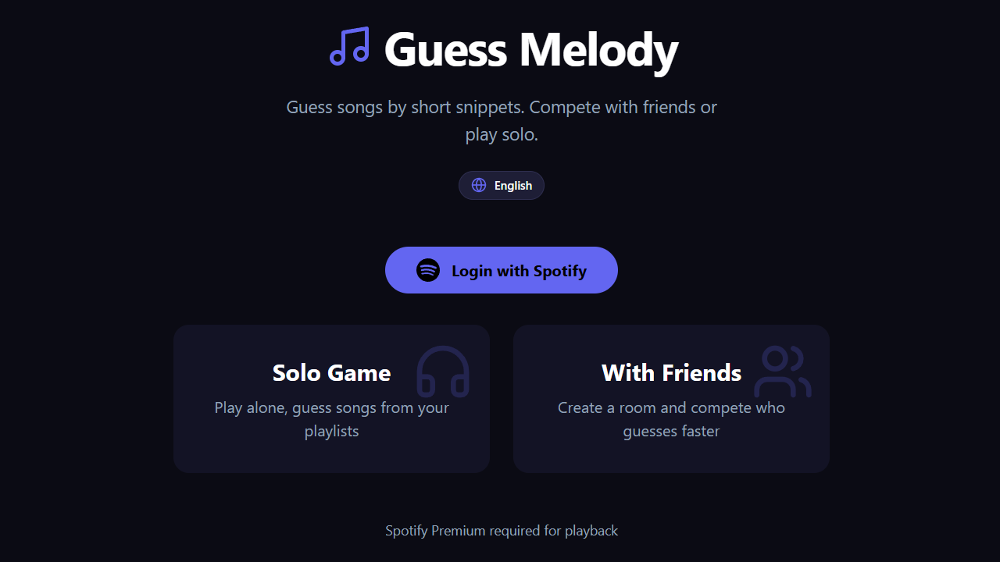
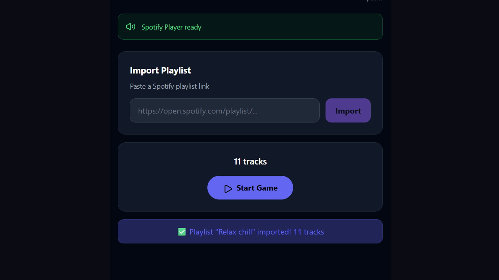
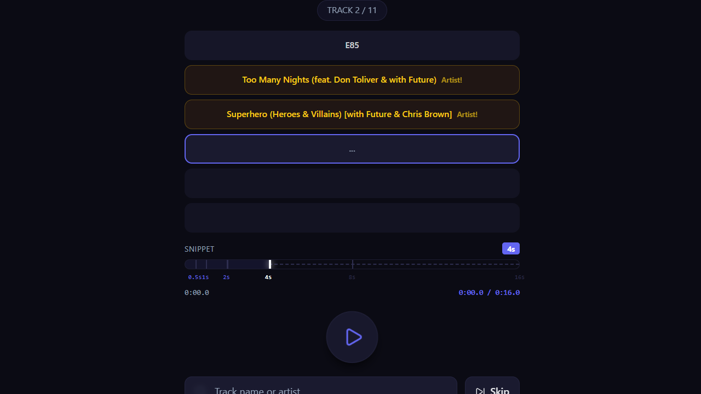
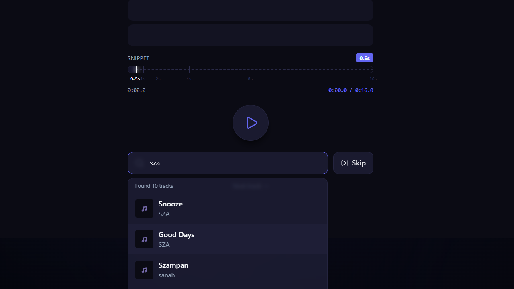
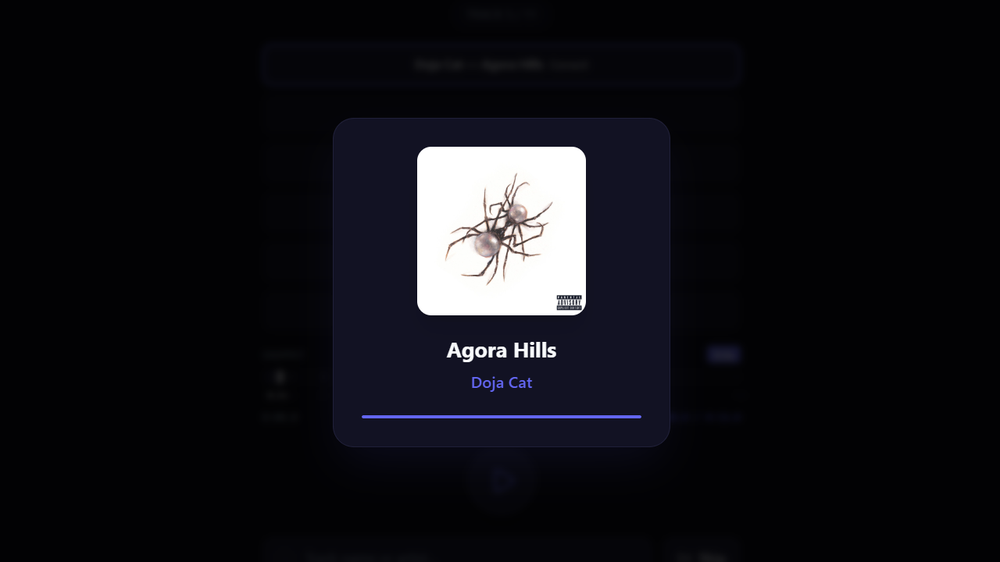
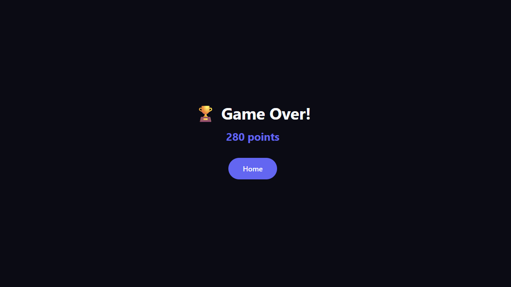

# 🎵 Guess Melody — Real-time Multiplayer Music Guessing Game

A full-stack web application where players guess songs from short Spotify snippets. Play solo to practise or compete with friends in real-time multiplayer rooms. Built as a portfolio project to demonstrate Java backend development, third-party API integration, WebSocket communication, and a modern React frontend.

> **Note:** This is an educational pet project. It is not affiliated with or endorsed by Spotify.

---

## ✨ Features

- **Solo mode** — import any Spotify playlist and guess tracks across configurable rounds
- **Multiplayer rooms** — create or join a room with a short code and play against friends in real time
- **Spotify integration** — OAuth login, playlist import, track search, and playback via the Web Playback SDK
- **Progressive snippets** — each attempt reveals a longer audio snippet (0.5s → 1s → 2s → ...)
- **Artist hints** — guess the artist for partial points, then finish the round by guessing the title
- **Real-time state** — WebSocket (STOMP) broadcasts round starts, guesses, scores, and game-over events
- **Responsive dark UI** — glassmorphism design built with React, TypeScript, Vite, and Tailwind CSS
- **Auto-build pipeline** — Gradle builds and bundles the React app automatically; no manual `npm run build` needed

---

## 🛠️ Tech Stack

### Backend
- **Java 17 / 21**
- **Spring Boot 3.3**
- **Spring WebSocket (STOMP)** — real-time multiplayer communication
- **Spring Data JPA** — data persistence
- **Spring Security** — CORS and basic security configuration
- **Spotify Web API Java wrapper** — playlist import, track search, metadata
- **H2** (dev) / **PostgreSQL** (prod)
- **Gradle Kotlin DSL**

### Frontend
- **React 19**
- **TypeScript**
- **Vite**
- **React Router**
- **Tailwind CSS**
- **Spotify Web Playback SDK** — audio playback
- **i18next** — English / Russian language switcher

### DevOps / Tools
- **Docker** + **Docker Compose** (optional)
- **Git / GitHub**
- **GitHub Actions** CI
- **IntelliJ IDEA**

---

## 🏗️ Architecture

```
com.guessmelody
├── config/         # WebSocket, Spotify, Security, SPA routing
├── controller/     # REST and WebSocket controllers
├── service/        # Business logic interfaces
├── service/impl/   # Business logic implementations
├── repository/     # Spring Data JPA repositories
├── model/          # JPA entities and enums
├── dto/            # Data transfer objects
├── exception/      # Custom exceptions
├── game/           # In-memory game state
└── util/           # Utility classes
```

### Communication Flow
1. The frontend connects to `/ws` via SockJS/STOMP.
2. Players join rooms through `/app/room/{code}/join`.
3. The host starts the game via `/app/room/{code}/start`.
4. The server broadcasts game events to `/topic/room/{code}`:
   - `ROUND_START`
   - `PLAY_TRACK`
   - `GUESS_RESULT`
   - `ROUND_END`
   - `GAME_OVER`
5. Track metadata is fetched from the Spotify Web API; playback uses the Spotify Web Playback SDK.

---

## 🚀 Getting Started

### Prerequisites
- JDK 17 or 21
- Node.js 18+ (only if you run the frontend separately)
- Spotify Developer account (free) — [create one here](https://developer.spotify.com/dashboard)
- Docker (optional)

### 1. Spotify Credentials

Create an app in the Spotify Developer Dashboard and add `http://127.0.0.1:8080/api/spotify/callback` to the allowed redirect URIs.

Copy the example environment file and fill in your credentials:

```bash
cp .env.example .env
```

```env
SPOTIFY_CLIENT_ID=your_spotify_client_id
SPOTIFY_CLIENT_SECRET=your_spotify_client_secret
SPOTIFY_REDIRECT_URI=http://127.0.0.1:8080/api/spotify/callback
SERVER_PORT=8080
```

> **Important:** Never commit the `.env` file. It is already listed in `.gitignore`.

### 2. Run the Application

The Gradle Node plugin downloads Node, installs dependencies, builds the React app, and copies it into `src/main/resources/static` automatically.

```bash
./gradlew bootRun
```

On Windows:

```bash
gradlew.bat bootRun
```

Open `http://localhost:8080` in your browser.

### 3. Access the H2 Console (dev only)

- URL: `http://localhost:8080/h2-console`
- JDBC URL: `jdbc:h2:mem:guessmelodydb`
- User: `sa`
- Password: *(leave empty)*

---

## 🐳 Docker Compose (Optional)

To run the backend together with a PostgreSQL database:

```bash
docker-compose up -d
```

This starts:
- PostgreSQL on port `5432`
- The Spring Boot backend on port `8080`

---

## 🎯 Scoring

| Attempt | Track only | Artist only |
|--------:|-----------:|------------:|
| 1st     | 100        | 50          |
| 2nd     | 80         | 40          |
| 3rd     | 60         | 30          |
| 4th     | 40         | 20          |
| 5th     | 20         | 10          |
| 6th     | 10         | 5           |

- Guessing the track ends the round and awards the track score for that attempt.
- Guessing only the artist gives half the track score and advances the attempt.
- If you guess the artist first and the track later, the round total is the **better** of the two scores — you never get less than the artist-only score, and never more than the track-only score for the attempt on which the track was guessed.

---

## 📸 Screenshots

### Home


### Import a Spotify Playlist


### Solo Gameplay


### Track Search Autocomplete


### Track Reveal


### Game Over


---

## 🧪 Running Tests

```bash
./gradlew test
```

---

## 🛣️ Roadmap / Possible Improvements

- [ ] Replace in-memory room state with Redis for horizontal scaling
- [ ] Deploy to AWS / Azure / Render
- [ ] Add spectator mode and persistent game history
- [ ] Add public/private room visibility
- [ ] Add end-to-end tests with Playwright
- [ ] Add global leaderboard

---

## 📄 License

This project is for educational and portfolio purposes only.
